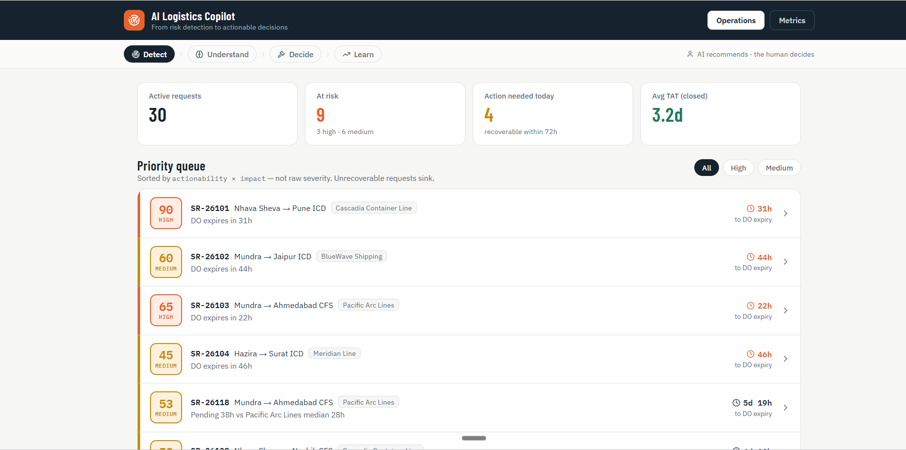
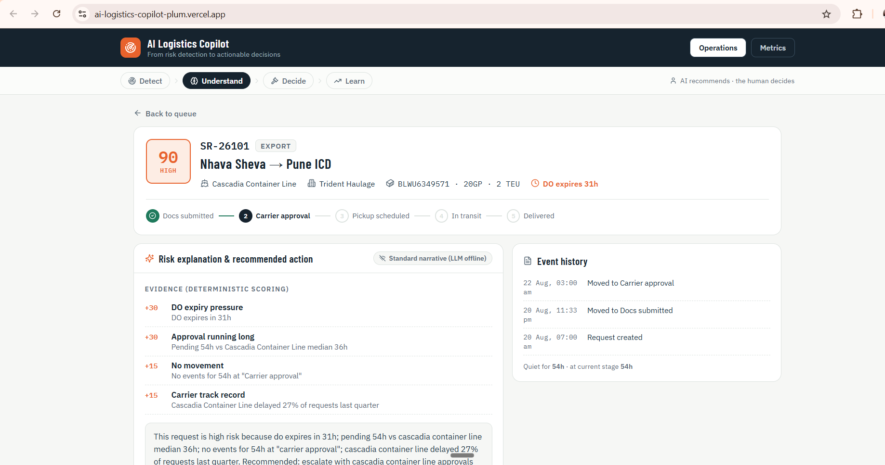
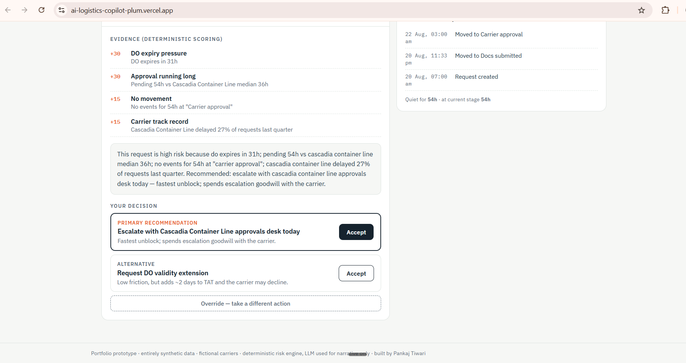

# AI Logistics Copilot — Product Case Study

> From risk detection to actionable decisions.

## 1. Executive Summary

Logistics operations teams often know that a shipment request is becoming risky, but identifying the problem is only the beginning.

The larger operational cost comes from diagnosing why the request is at risk, deciding what action to take, coordinating the response, and learning from the outcome.

The AI Logistics Copilot is an independent Product Management portfolio prototype exploring how AI can compress that workflow:

**Detect → Understand → Decide → Learn**

The product is designed as a decision-support system rather than an autonomous decision-maker.

AI identifies risk, explains the evidence, and recommends an action.  
The human operator remains accountable for the final decision.

---

## 2. The Problem

Operations teams managing logistics requests may need to monitor:

- document and approval status
- pickup and delivery milestones
- deadlines and expiry windows
- carrier performance
- time spent at each workflow stage
- historical patterns
- exceptions and operational events

A request can therefore become risky for several different reasons.

For example:

- a deadline may be approaching
- an approval may be taking longer than normal
- there may have been no recent movement
- a carrier may have a history of delays
- multiple risk signals may be occurring simultaneously

The challenge is not simply identifying a delayed request.

The challenge is answering:

**Why is this request at risk, what should the operator do next, and how confident should they be in that recommendation?**

---

## 3. Product Opportunity

The product opportunity is to move operations teams from:

**Monitoring → Investigation → Decision**

toward:

**Risk detection → Evidence-based explanation → Recommended action**

This creates a focused AI copilot for operational decision-making.

The goal is not to replace the operations team.

The goal is to reduce the cognitive and time burden involved in moving from an operational signal to an informed decision.

---

## 4. Product Thesis

For operations teams, detecting a delayed request is only the beginning.

The expensive part is the time spent:

1. finding the requests that require attention
2. understanding why they are risky
3. determining which intervention is most appropriate
4. executing the intervention
5. measuring whether the intervention worked

The AI Logistics Copilot compresses this workflow into four stages:

**Detect → Understand → Decide → Learn**

### Detect

Identify requests where intervention may be required.

### Understand

Explain the risk using observable evidence rather than an unexplained AI score.

### Decide

Recommend an operational action while showing alternatives and trade-offs.

### Learn

Capture outcomes, overrides, and false negatives so that the product can improve over time.

---

## 5. Target Users

### Primary user

**Logistics Operations / Control Tower Analyst**

Responsible for monitoring active requests, identifying exceptions, coordinating with carriers and internal teams, and resolving issues before they become operational failures.

### Secondary users

- Operations managers
- Control tower leads
- Customer service teams
- Logistics product managers
- Process improvement teams

The prototype focuses primarily on the individual operator making the next operational decision.

---

## 6. Core User Journey

### 6.1 Detect

The operator starts with a prioritized queue rather than a flat list of requests.

The queue surfaces:

- active requests
- risk level
- deadline pressure
- actionability
- time remaining
- relevant operational context

The prototype deliberately prioritizes **actionability × impact**, rather than simply sorting by raw risk score.

This helps operators focus on requests where intervention can still change the outcome.

---

### 6.2 Understand

Selecting a request opens an evidence-backed explanation.

The prototype surfaces contributing factors such as:

- deadline / DO expiry pressure
- time spent in the current workflow stage
- absence of recent movement
- carrier historical performance
- comparison against relevant operational medians

The objective is explainability.

Instead of:

> "AI says this request is high risk."

the product should answer:

> "This request is high risk because these observable conditions are occurring."

---

### 6.3 Decide

The system converts the diagnosis into a recommended action.

The recommendation should communicate:

- proposed action
- rationale
- expected benefit
- relevant trade-offs
- alternative action where appropriate

The operator remains in control.

**AI recommends. The human decides.**

---

### 6.4 Learn

The product records what happened after the recommendation.

This includes:

- action selected
- action rejected or overridden
- reason for override
- operational outcome
- eventual resolution
- false positive / false negative signals

This creates the foundation for measuring whether the AI is actually improving operational decision-making.

---

## 7. Risk Scoring Approach

The prototype uses deterministic scoring rather than an opaque predictive model.

This is intentional.

For a portfolio prototype, deterministic scoring makes the reasoning inspectable and allows the operator to see exactly why a request has been prioritized.

Example evidence signals include:

| Signal | Example contribution |
|---|---:|
| Deadline / DO expiry pressure | +30 |
| Workflow stage running longer than benchmark | +30 |
| No recent operational movement | +15 |
| Carrier historical delay pattern | +15 |

The resulting score is then translated into an operational risk category.

The score itself is not intended to represent a production-ready ML model.

It demonstrates the product principle:

**risk should be explainable, evidence-backed, and actionable.**

---

## 8. Why Explainability Matters

In operational environments, an unexplained AI recommendation can create more problems than it solves.

An operator needs to understand:

- what triggered the recommendation
- which evidence matters most
- whether the evidence is current
- what assumptions are being made
- what could happen if the recommendation is followed
- when the operator should override the recommendation

Therefore, explainability is treated as a core product capability rather than an additional feature.

---

## 9. Human-in-the-Loop Design

The system intentionally avoids fully autonomous decision-making.

The operating principle is:

> **AI recommends. The human makes the final decision.**

This is particularly important when actions can affect:

- customer commitments
- carrier relationships
- operational costs
- service levels
- downstream logistics activities

The product therefore creates a clear boundary between:

**AI-generated recommendation**

and

**human-approved operational action**

---

## 10. Handling AI Failure

A useful AI product must measure not only where the model is correct, but also where it fails.

The prototype therefore considers:

### False positives

A request is flagged as risky but does not ultimately require intervention.

### False negatives

A request is not flagged as risky but subsequently becomes an operational problem.

False negatives are especially important because they represent potentially missed operational risk.

The product should therefore track these outcomes and use them as part of the learning loop.

---

## 11. Override Tracking

Operators should be able to disagree with the recommendation.

An override is not automatically treated as a user failure.

It can represent:

- missing context
- outdated evidence
- an incorrect recommendation
- an intentional business decision
- a constraint that is not visible to the system

Capturing the reason for overrides creates a valuable feedback signal.

This can help identify gaps in:

- data
- business rules
- model behavior
- workflow design
- user experience

---

## 12. Metrics Framework

The product should measure more than model accuracy.

### Operational metrics

- intervention rate
- time to resolution
- average turnaround time
- percentage of requests resolved before deadline
- preventable escalation rate

### AI performance metrics

- precision of risk detection
- false-positive rate
- false-negative rate
- recommendation acceptance rate
- recommendation override rate

### Decision-quality metrics

- time from detection to action
- percentage of recommendations resulting in successful resolution
- operator confidence
- reason distribution for overrides

### Product adoption metrics

- weekly active operators
- requests reviewed per operator
- percentage of risk cases opened
- percentage of recommendations acted upon

The most important question is:

**Does the copilot help operators make faster and better decisions?**

---

## 13. Prioritization Philosophy

Not every risky request deserves immediate intervention.

The prototype therefore separates:

**Risk**

from

**Actionability**

A request can have high theoretical risk but little opportunity for intervention.

Conversely, a moderately risky request may deserve immediate attention if a relatively simple intervention can prevent deterioration.

This leads to the prioritization principle:

> **Prioritize the requests where timely human intervention can still change the outcome.**

---

## 14. What the Prototype Demonstrates

The prototype demonstrates several product capabilities:

- risk-based operational triage
- evidence-backed AI explanations
- actionable recommendations
- alternative actions and trade-offs
- human-in-the-loop decision making
- override tracking
- reason capture
- AI performance measurement
- false-negative awareness
- operational metrics

It is intentionally focused on the decision-support layer rather than attempting to build a complete logistics management platform.

---

## 15. What Is Deliberately Out of Scope

This prototype does not attempt to build:

- a complete transportation management system
- carrier booking infrastructure
- live shipment tracking
- production-grade predictive ML
- automated carrier communication
- automated operational execution
- financial settlement
- a full enterprise analytics platform

These exclusions are deliberate product-scoping decisions.

The prototype focuses on the highest-value product question:

**How can AI help an operations professional move from risk detection to an informed decision faster?**

---

## 16. Data & Prototype Disclaimer

This portfolio prototype uses synthetic / fictional operational data and fictional carrier names.

It does not use proprietary company data, confidential customer information, or confidential operational information.

The purpose of the prototype is to demonstrate product thinking, workflow design, AI decision-support principles, and measurable product outcomes.

---

## 17. Product Trade-offs

### Automation vs control

More automation can reduce operator workload, but increases the risk of inappropriate actions.

The prototype therefore favors human approval for consequential decisions.

### Explainability vs simplicity

Showing every available signal can overwhelm the operator.

The product therefore emphasizes the evidence most relevant to the current recommendation.

### Risk sensitivity vs alert fatigue

A system that flags everything as risky becomes ineffective.

The product therefore prioritizes actionable risk rather than maximizing the number of alerts.

### Model sophistication vs trust

A more sophisticated model is not automatically a better product.

For this prototype, transparent deterministic scoring provides a stronger demonstration of explainable decision support.

---

## 18. Future Product Evolution

A production version could evolve through several stages.

### Phase 1 — Decision support

- deterministic risk rules
- evidence-backed explanations
- recommendations
- operator feedback
- override tracking

### Phase 2 — Learning system

- outcome-based model evaluation
- improved risk prediction
- personalized thresholds
- carrier and lane benchmarks
- recommendation effectiveness measurement

### Phase 3 — Workflow integration

- operational system integrations
- automated notifications
- task creation
- escalation workflows
- approved-action execution

### Phase 4 — Predictive operations

The longer-term opportunity is to move from:

**"This request is at risk."**

to:

**"This request is likely to become at risk, and this intervention has the highest probability of preventing the issue."**

---

## 19. Key Product Decisions

The most important product decisions in this prototype are:

1. **Prioritize actionability, not just risk.**
2. **Show evidence behind AI recommendations.**
3. **Keep humans accountable for consequential decisions.**
4. **Capture overrides as product-learning signals.**
5. **Measure false negatives, not only successful predictions.**
6. **Optimize for operational outcomes rather than AI novelty.**
7. **Keep the first version focused on decision support rather than attempting to automate the entire logistics workflow.**

---

## 20. Portfolio Takeaway

The AI Logistics Copilot demonstrates a product approach to AI that starts with an operational problem rather than with the technology.

The core product question is not:

> "Where can we add AI?"

It is:

> **"Where does AI meaningfully reduce the time and cognitive effort required to make a better operational decision?"**

The prototype demonstrates one answer:

**Detect → Understand → Decide → Learn**

The AI provides the signal and the reasoning.

The operator provides the judgment.

The product measures what happened next.

---

## 21. Live Prototype

**Live demo:**  
https://ai-logistics-copilot-plum.vercel.app/

The recommended demo journey is:

**Operations → SR-26101 → Understand → Decide → Metrics**

This demonstrates the complete product loop from risk identification through decision support and measurement.
